# Campus Delivery Breakthrough Thesis Implementation Plan

> **For agentic workers:** REQUIRED SUB-SKILL: Use superpowers:subagent-driven-development (recommended) or superpowers:executing-plans to implement this plan task-by-task. Steps use checkbox (`- [ ]`) syntax for tracking.

**Goal:** Produce a breakthrough revision of the campus delivery undergraduate thesis that improves academic completeness and defense readiness while preserving the school Word format.

**Architecture:** Treat the current desktop DOCX as the only format carrier and treat current source code, SQL, miniapp code, backend code, and real screenshots as the evidence layer. Build a project-local breakthrough workspace, regenerate text/figures/screenshots from current evidence, then write them back into a new DOCX copy and render-check the result.

**Tech Stack:** Python 3 with `python-docx`, OOXML inspection, Mermaid SVG export, Chrome/DevTools screenshots, Spring Boot backend, uni-app mini program source, Nginx-hosted Web admin, artifact-tool DOCX renderer.

---

## Scope Check

This plan covers one integrated deliverable: the main thesis DOCX. It includes evidence refresh, chapter rewrite, chart generation, optional Web screenshots, Word reconstruction, and visual QA. It does not modify application source code.

The plan intentionally ignores historical generated thesis content as a factual source. Existing `paper-output/` files can be inspected only for prior formatting risks, not copied as new thesis prose.

## File Structure

### Read-only Inputs

- `C:/Users/g'y'c/Desktop/校园外卖设计与实现-学校规范格式终稿_已替换.docx`: latest thesis DOCX and school format carrier.
- `C:/Users/g'y'c/Desktop/start-campus-delivery.cmd`: startup script for real Web screenshots.
- `D:/sky-delivery/core/backend/**`: backend implementation evidence.
- `D:/sky-delivery/core/miniapp/**`: mini program implementation evidence.
- `D:/sky-delivery/core/database/init.sql`: base database schema.
- `D:/sky-delivery/core/backend/scripts/phase1_multi_merchant_schema.sql`: multi-merchant schema evidence.
- `D:/sky-delivery/core/docs/superpowers/specs/2026-05-14-campus-delivery-breakthrough-thesis-design.md`: approved design spec.

### Created Outputs

- `D:/sky-delivery/core/paper-output/breakthrough/source/latest-docx-map.json`: extracted structure of the latest DOCX.
- `D:/sky-delivery/core/paper-output/breakthrough/source/latest-docx-headings.md`: latest DOCX outline snapshot.
- `D:/sky-delivery/core/paper-context/evidence/breakthrough-source-facts.json`: fresh source/database/API evidence summary.
- `D:/sky-delivery/core/paper-context/evidence/breakthrough-chart-registry.md`: final figure registry and placement decisions.
- `D:/sky-delivery/core/paper-output/breakthrough/source/校园外卖设计与实现-突破重构正文.md`: rewritten thesis body source.
- `D:/sky-delivery/core/paper-output/breakthrough/figures/source/*.mmd`: Mermaid source files.
- `D:/sky-delivery/core/paper-output/breakthrough/figures/svg/*.svg`: final vector figures.
- `D:/sky-delivery/core/paper-output/breakthrough/screenshots/web-admin/*.png`: real Web admin screenshots when added.
- `D:/sky-delivery/core/paper-output/breakthrough/校园外卖设计与实现-学校规范格式终稿_突破重构.docx`: final revised DOCX.
- `D:/sky-delivery/core/paper-output/breakthrough/rendered/main/page-*.png`: rendered DOCX pages for visual QA.
- `D:/sky-delivery/core/paper-output/breakthrough/breakthrough_static_check.json`: static QA report.
- `D:/sky-delivery/core/paper-output/breakthrough/突破重构交付说明.md`: delivery report.

### Created Helper Scripts

- `D:/sky-delivery/core/paper-output/breakthrough/tools/extract_docx_map.py`: reads latest DOCX and extracts outline/structure.
- `D:/sky-delivery/core/paper-output/breakthrough/tools/collect_breakthrough_facts.py`: extracts current entities, SQL tables, and routes.
- `D:/sky-delivery/core/paper-output/breakthrough/tools/build_breakthrough_docx.py`: creates the final DOCX copy and replaces thesis body content.
- `D:/sky-delivery/core/paper-output/breakthrough/tools/check_breakthrough_docx.py`: checks banned words, image density, headings, and basic DOCX properties.

### Files Not To Modify

- Application source under `backend/`, `miniapp/`, and `nginx/`.
- The desktop source DOCX.
- Historical generated thesis DOCX files outside `paper-output/breakthrough/`.

---

### Task 1: Prepare Breakthrough Workspace And Extract Current DOCX Structure

**Files:**
- Create: `D:/sky-delivery/core/paper-output/breakthrough/tools/extract_docx_map.py`
- Create: `D:/sky-delivery/core/paper-output/breakthrough/source/latest-docx-map.json`
- Create: `D:/sky-delivery/core/paper-output/breakthrough/source/latest-docx-headings.md`

- [ ] **Step 1: Create project-local workspace folders**

Run:

```powershell
New-Item -ItemType Directory -Force -Path `
  "D:\sky-delivery\core\paper-output\breakthrough\tools",`
  "D:\sky-delivery\core\paper-output\breakthrough\source",`
  "D:\sky-delivery\core\paper-output\breakthrough\figures\source",`
  "D:\sky-delivery\core\paper-output\breakthrough\figures\svg",`
  "D:\sky-delivery\core\paper-output\breakthrough\screenshots\web-admin",`
  "D:\sky-delivery\core\paper-output\breakthrough\rendered\main"
```

Expected: directories exist under `D:/sky-delivery/core/paper-output/breakthrough/`.

- [ ] **Step 2: Create the DOCX structure extractor**

Create `D:/sky-delivery/core/paper-output/breakthrough/tools/extract_docx_map.py` with:

```python
from __future__ import annotations

import json
import re
import sys
from pathlib import Path

from docx import Document


HEADING_RE = re.compile(
    r"^(第[一二三四五六七八九十]+章|[0-9]+(\.[0-9]+){0,3}\s+|摘\s*要|ABSTRACT|目\s*录|参考文献|致\s*谢|附\s*录)"
)


def classify(text: str, style_name: str) -> str:
    compact = text.replace(" ", "")
    lower_style = style_name.lower()
    if lower_style.startswith("heading") or HEADING_RE.match(compact):
        return "heading"
    if text.startswith("图 ") or text.startswith("表 "):
        return "caption"
    return "body"


def main() -> None:
    if len(sys.argv) != 3:
        raise SystemExit("Usage: extract_docx_map.py <input.docx> <output-dir>")

    input_docx = Path(sys.argv[1])
    output_dir = Path(sys.argv[2])
    output_dir.mkdir(parents=True, exist_ok=True)

    doc = Document(input_docx)
    paragraphs = []
    headings = []
    for index, paragraph in enumerate(doc.paragraphs):
        text = paragraph.text.strip()
        if not text:
            continue
        style_name = paragraph.style.name if paragraph.style is not None else ""
        kind = classify(text, style_name)
        item = {
            "paragraph_index": index,
            "style": style_name,
            "kind": kind,
            "text": text,
            "length": len(text),
        }
        paragraphs.append(item)
        if kind == "heading":
            headings.append(item)

    payload = {
        "input_docx": str(input_docx),
        "nonempty_paragraphs": len(paragraphs),
        "tables": len(doc.tables),
        "inline_shapes": len(doc.inline_shapes),
        "sections": len(doc.sections),
        "headings": headings,
        "paragraphs": paragraphs,
    }

    (output_dir / "latest-docx-map.json").write_text(
        json.dumps(payload, ensure_ascii=False, indent=2),
        encoding="utf-8",
    )

    lines = ["# Latest DOCX Heading Snapshot", ""]
    for item in headings:
        lines.append(f"- P{item['paragraph_index']}: {item['text']}")
    (output_dir / "latest-docx-headings.md").write_text(
        "\n".join(lines) + "\n",
        encoding="utf-8",
    )


if __name__ == "__main__":
    main()
```

- [ ] **Step 3: Run the extractor on the latest DOCX**

Run:

```powershell
& "C:\Users\g'y'c\.cache\codex-runtimes\codex-primary-runtime\dependencies\python\python.exe" `
  "D:\sky-delivery\core\paper-output\breakthrough\tools\extract_docx_map.py" `
  "C:\Users\g'y'c\Desktop\校园外卖设计与实现-学校规范格式终稿_已替换.docx" `
  "D:\sky-delivery\core\paper-output\breakthrough\source"
```

Expected:

- `latest-docx-map.json` exists.
- `latest-docx-headings.md` exists.
- The heading snapshot includes the seven main chapters, references, acknowledgements, and appendix.

- [ ] **Step 4: Commit the extraction setup**

Run:

```powershell
git add -- `
  "core/paper-output/breakthrough/tools/extract_docx_map.py" `
  "core/paper-output/breakthrough/source/latest-docx-map.json" `
  "core/paper-output/breakthrough/source/latest-docx-headings.md"
git commit -m "docs: map latest thesis docx structure"
```

Expected: commit succeeds and does not include unrelated dirty files.

---

### Task 2: Build Fresh Source Evidence Pack

**Files:**
- Create: `D:/sky-delivery/core/paper-output/breakthrough/tools/collect_breakthrough_facts.py`
- Create: `D:/sky-delivery/core/paper-context/evidence/breakthrough-source-facts.json`

- [ ] **Step 1: Create the source fact collector**

Create `D:/sky-delivery/core/paper-output/breakthrough/tools/collect_breakthrough_facts.py` with:

```python
from __future__ import annotations

import json
import re
from pathlib import Path


ROOT = Path("D:/sky-delivery/core")
JAVA_ENTITY_DIR = ROOT / "backend/sky-pojo/src/main/java/com/sky/entity"
CONTROLLER_DIR = ROOT / "backend/sky-server/src/main/java/com/sky/controller"
SQL_FILES = [
    ROOT / "database/init.sql",
    ROOT / "backend/scripts/phase1_multi_merchant_schema.sql",
]

FIELD_RE = re.compile(r"private\s+([A-Za-z0-9_<>, ?]+)\s+([a-zA-Z][A-Za-z0-9_]*)\s*;")
TABLE_RE = re.compile(r"CREATE\s+TABLE\s+(?:IF\s+NOT\s+EXISTS\s+)?`?([a-zA-Z0-9_]+)`?", re.IGNORECASE)
COLUMN_RE = re.compile(r"^\s*`([a-zA-Z0-9_]+)`\s+([a-zA-Z0-9()]+)", re.IGNORECASE)
ALTER_ADD_RE = re.compile(r"ADD\s+COLUMN\s+([a-zA-Z0-9_]+)\s+([A-Z0-9(),]+)", re.IGNORECASE)
ROUTE_RE = re.compile(r"@(GetMapping|PostMapping|PutMapping|DeleteMapping|RequestMapping)\(([^)]*)\)")


def read(path: Path) -> str:
    return path.read_text(encoding="utf-8", errors="ignore")


def collect_entities() -> dict[str, list[dict[str, str]]]:
    entities: dict[str, list[dict[str, str]]] = {}
    for path in sorted(JAVA_ENTITY_DIR.glob("*.java")):
        fields = []
        for type_name, field_name in FIELD_RE.findall(read(path)):
            fields.append({"name": field_name, "type": " ".join(type_name.split())})
        entities[path.stem] = fields
    return entities


def collect_sql_tables() -> dict[str, dict[str, object]]:
    tables: dict[str, dict[str, object]] = {}
    current_table = None
    for sql_file in SQL_FILES:
        for line in read(sql_file).splitlines():
            table_match = TABLE_RE.search(line)
            if table_match:
                current_table = table_match.group(1)
                tables.setdefault(current_table, {"source_files": [], "columns": []})
                tables[current_table]["source_files"].append(str(sql_file))
                continue
            if current_table is not None:
                column_match = COLUMN_RE.match(line)
                if column_match:
                    tables[current_table]["columns"].append(
                        {"name": column_match.group(1), "type": column_match.group(2)}
                    )
            alter_match = ALTER_ADD_RE.search(line)
            if alter_match and current_table is not None:
                tables[current_table]["columns"].append(
                    {"name": alter_match.group(1), "type": alter_match.group(2), "added_by_alter": True}
                )
    return tables


def collect_routes() -> list[dict[str, str]]:
    routes = []
    for path in sorted(CONTROLLER_DIR.rglob("*.java")):
        text = read(path)
        for annotation, raw_value in ROUTE_RE.findall(text):
            value = raw_value.replace('"', "").replace("{", "").replace("}", "").strip()
            routes.append(
                {
                    "controller": str(path.relative_to(ROOT)),
                    "annotation": annotation,
                    "value": value,
                }
            )
    return routes


def main() -> None:
    output = ROOT / "paper-context/evidence/breakthrough-source-facts.json"
    output.parent.mkdir(parents=True, exist_ok=True)
    payload = {
        "rule": "Use this file as a fresh evidence index only; do not copy historical thesis prose.",
        "entities": collect_entities(),
        "sql_tables": collect_sql_tables(),
        "routes": collect_routes(),
        "known_core_flows": [
            "用户登录",
            "商户选择与商品浏览",
            "添加购物车",
            "订单提交",
            "订单支付回调",
            "商家订单处理",
            "订单催单通知",
        ],
    }
    output.write_text(json.dumps(payload, ensure_ascii=False, indent=2), encoding="utf-8")
    print(output)


if __name__ == "__main__":
    main()
```

- [ ] **Step 2: Run the source fact collector**

Run:

```powershell
& "C:\Users\g'y'c\.cache\codex-runtimes\codex-primary-runtime\dependencies\python\python.exe" `
  "D:\sky-delivery\core\paper-output\breakthrough\tools\collect_breakthrough_facts.py"
```

Expected: command prints `D:\sky-delivery\core\paper-context\evidence\breakthrough-source-facts.json`.

- [ ] **Step 3: Inspect evidence for required entities and routes**

Run:

```powershell
Select-String -Path "D:\sky-delivery\core\paper-context\evidence\breakthrough-source-facts.json" `
  -Pattern '"Orders"','"ShoppingCart"','"Merchant"','"Campus"','/user/order','/admin/order','/user/shoppingCart'
```

Expected: each pattern has at least one match.

- [ ] **Step 4: Commit the fresh evidence pack**

Run:

```powershell
git add -- `
  "core/paper-output/breakthrough/tools/collect_breakthrough_facts.py" `
  "core/paper-context/evidence/breakthrough-source-facts.json"
git commit -m "docs: refresh thesis source evidence"
```

Expected: commit succeeds and includes only these two paths.

---

### Task 3: Author Chart Registry And Placement Rules

**Files:**
- Create: `D:/sky-delivery/core/paper-context/evidence/breakthrough-chart-registry.md`

- [ ] **Step 1: Create chart registry with final placement decisions**

Create `D:/sky-delivery/core/paper-context/evidence/breakthrough-chart-registry.md` with:

```markdown
# Breakthrough Thesis Chart Registry

## Global Style

- Language: Chinese labels only.
- Color: black, white, gray, with deep blue emphasis.
- Export: SVG preferred; PNG must be high resolution.
- Layout: vertical for all flowcharts.
- Shape rules: rectangles for normal steps; diamonds for decisions; edges labeled 是/否 where a branch exists.
- Density: no one-page-one-figure layout; no two figures placed back-to-back.

## Figure Plan

| Figure | Title | Chapter | Purpose | Insert Size |
| --- | --- | --- | --- | --- |
| 图 2-1 | 校园外卖业务角色关系图 | 第二章 | Explain student, merchant, and platform roles | 75% text width |
| 图 4-1 | 系统总体架构图 | 第四章 | Explain end-to-end architecture | 85% text width |
| 图 4-2 | 系统功能模块结构图 | 第四章 | Explain module boundaries | 75% text width |
| 图 5-1 | 核心数据实体关系图 | 第五章 | Explain entity relationships | 85% text width |
| 图 5-2 | 订单状态流转图 | 第五章 | Explain order lifecycle | 70% text width |
| 图 6-1 | 用户登录原子流程图 | 第六章 | Explain login logic | 70% text width |
| 图 6-2 | 商户选择与商品浏览原子流程图 | 第六章 | Explain storefront browsing | 70% text width |
| 图 6-3 | 添加购物车原子流程图 | 第六章 | Explain merchant-scoped cart behavior | 70% text width |
| 图 6-4 | 订单提交原子流程图 | 第六章 | Explain order creation transaction | 75% text width |
| 图 6-5 | 订单支付回调原子流程图 | 第六章 | Explain payment callback | 70% text width |
| 图 6-6 | 商家订单处理原子流程图 | 第六章 | Explain merchant order handling | 70% text width |
| 图 6-7 | 订单催单通知原子流程图 | 第六章 | Explain reminder notification | 70% text width |

## Placement Rules

1. Insert a paragraph before every figure that explicitly introduces why the figure is needed.
2. Insert a paragraph after every figure explaining the key conclusion.
3. Do not place two figures consecutively.
4. If two figures are useful in the same subsection, keep only the stronger one in the main text and move the other to appendix or omit it.
5. Prefer real Web screenshots only when they improve defense readability.
```

- [ ] **Step 2: Check registry contains all approved layout constraints**

Run:

```powershell
Select-String -Path "D:\sky-delivery\core\paper-context\evidence\breakthrough-chart-registry.md" `
  -Pattern "no one-page-one-figure","no two figures","70% text width","SVG preferred","diamonds"
```

Expected: each pattern has a match.

- [ ] **Step 3: Commit chart registry**

Run:

```powershell
git add -- "core/paper-context/evidence/breakthrough-chart-registry.md"
git commit -m "docs: define breakthrough thesis chart registry"
```

Expected: commit succeeds.

---

### Task 4: Generate Academic Figure Sources And SVG Exports

**Files:**
- Create: `D:/sky-delivery/core/paper-output/breakthrough/figures/source/*.mmd`
- Create: `D:/sky-delivery/core/paper-output/breakthrough/figures/svg/*.svg`

- [ ] **Step 1: Create Mermaid source files from Appendix A**

For each diagram in Appendix A, create a separate `.mmd` file under:

`D:/sky-delivery/core/paper-output/breakthrough/figures/source/`

Use these exact filenames:

- `figure-2-1-role-relation.mmd`
- `figure-4-1-architecture.mmd`
- `figure-4-2-modules.mmd`
- `figure-5-1-er.mmd`
- `figure-5-2-order-state.mmd`
- `figure-6-1-login-flow.mmd`
- `figure-6-2-merchant-browse-flow.mmd`
- `figure-6-3-cart-add-flow.mmd`
- `figure-6-4-order-submit-flow.mmd`
- `figure-6-5-payment-callback-flow.mmd`
- `figure-6-6-merchant-order-flow.mmd`
- `figure-6-7-reminder-flow.mmd`

Expected: 12 `.mmd` files exist and contain no banned words.

- [ ] **Step 2: Export Mermaid files to SVG**

Run:

```powershell
$env:npm_config_cache="D:\sky-delivery\core\.deps\npm-cache"
Get-ChildItem "D:\sky-delivery\core\paper-output\breakthrough\figures\source" -Filter *.mmd | ForEach-Object {
  $out = "D:\sky-delivery\core\paper-output\breakthrough\figures\svg\" + $_.BaseName + ".svg"
  npx -y @mermaid-js/mermaid-cli -i $_.FullName -o $out -b transparent
}
```

Expected: 12 SVG files exist under `figures/svg/`. The npm cache is project-local under `D:/sky-delivery/core/.deps/npm-cache`.

- [ ] **Step 3: Check exported figures for banned words**

Run:

```powershell
Select-String -Path "D:\sky-delivery\core\paper-output\breakthrough\figures\svg\*.svg" `
  -Pattern "sky_take_out","苍穹外卖"
```

Expected: no matches.

- [ ] **Step 4: Commit Mermaid sources and SVG exports**

Run:

```powershell
git add -- `
  "core/paper-output/breakthrough/figures/source" `
  "core/paper-output/breakthrough/figures/svg"
git commit -m "docs: add breakthrough thesis figures"
```

Expected: commit succeeds.

---

### Task 5: Capture Real Web Admin Screenshots When They Add Value

**Files:**
- Create: `D:/sky-delivery/core/paper-output/breakthrough/screenshots/web-admin/dashboard.png`
- Create: `D:/sky-delivery/core/paper-output/breakthrough/screenshots/web-admin/orders.png`
- Create: `D:/sky-delivery/core/paper-output/breakthrough/screenshots/web-admin/products.png`
- Create: `D:/sky-delivery/core/paper-output/breakthrough/screenshots/web-admin/merchants.png`

- [ ] **Step 1: Start the application with the approved desktop script**

Run:

```powershell
Start-Process -FilePath "C:\Users\g'y'c\Desktop\start-campus-delivery.cmd" -WindowStyle Hidden
```

Expected:

- Backend URL: `http://localhost:8080`
- Frontend URL: `http://localhost:8081`
- Login account: `admin / 123456`

- [ ] **Step 2: Verify backend and frontend availability**

Run:

```powershell
Invoke-RestMethod -Uri "http://localhost:8080/actuator/health" -TimeoutSec 10
Invoke-WebRequest -Uri "http://localhost:8081" -UseBasicParsing -TimeoutSec 10 | Select-Object StatusCode
```

Expected:

- Health response status is `UP`.
- Frontend status code is `200`.

- [ ] **Step 3: Capture Web pages with browser tooling**

Use Chrome DevTools or Playwright to:

1. Open `http://localhost:8081`.
2. Log in with `admin / 123456`.
3. Capture dashboard, order management, product management, and merchant management pages.
4. Save screenshots to `D:/sky-delivery/core/paper-output/breakthrough/screenshots/web-admin/`.

Expected: screenshots show real app pages without browser chrome, desktop taskbar, console windows, or visible error states.

- [ ] **Step 4: Keep only screenshots that improve the thesis**

Run:

```powershell
Get-ChildItem "D:\sky-delivery\core\paper-output\breakthrough\screenshots\web-admin" -Filter *.png |
  Select-Object Name,Length
```

Expected: keep 1-4 screenshots. If a screenshot is visually weak, delete that screenshot and do not mention it in the thesis.

- [ ] **Step 5: Commit screenshots**

Run:

```powershell
git add -- "core/paper-output/breakthrough/screenshots/web-admin"
git commit -m "docs: capture breakthrough thesis screenshots"
```

Expected: commit succeeds if screenshots were captured. If no screenshot is kept, skip this commit and record the reason in the delivery report.

---

### Task 6: Rewrite Thesis Body Source With The New Academic Mainline

**Files:**
- Create: `D:/sky-delivery/core/paper-output/breakthrough/source/校园外卖设计与实现-突破重构正文.md`

- [ ] **Step 1: Create the new thesis body source**

Create `D:/sky-delivery/core/paper-output/breakthrough/source/校园外卖设计与实现-突破重构正文.md` with the following chapter skeleton and word targets:

```markdown
# 第一章 绪论

## 1.1 研究背景
目标字数：800-1000。写校园餐饮时间集中、服务半径固定、学生点餐效率、商家订单处理压力，不写空泛互联网背景。

## 1.2 研究意义
目标字数：700-900。从学生体验、商家管理、平台治理、毕业设计训练价值四个角度展开。

## 1.3 国内外相关技术概况
目标字数：900-1200。写移动点餐、小程序、前后端分离、订单管理类系统的通用发展，不虚构不可核验文献细节。

## 1.4 本文主要工作
目标字数：500-700。概括业务分析、需求建模、架构设计、数据库设计、核心流程实现和运行效果展示。

## 1.5 论文组织结构
目标字数：300-500。按七章说明全文安排。

# 第二章 校园外卖业务场景分析

## 2.1 校园订餐场景特点
目标字数：700-900。强调校园场景约束。

## 2.2 系统参与角色分析
目标字数：700-900。学生、商家人员、平台管理员三类角色；引用图 2-1。

## 2.3 学生点餐业务流程
目标字数：700-900。从进入小程序到支付、查看订单。

## 2.4 商家接单与商品维护流程
目标字数：700-900。从接单、拒单、配送、完成到商品维护。

## 2.5 平台管理业务流程
目标字数：500-700。商户、员工、统计与经营状态管理。

## 2.6 本章小结
目标字数：200-300。

# 第三章 系统需求分析

## 3.1 功能需求分析
目标字数：900-1200。按学生端、商家端、平台端组织。

## 3.2 非功能需求分析
目标字数：600-800。可用性、安全性、可维护性、扩展性。

## 3.3 业务规则分析
目标字数：700-900。购物车同商户隔离、订单状态顺序、地址绑定、商品上下架。

## 3.4 权限需求分析
目标字数：600-800。学生、商家员工、商家管理员、平台管理员边界。

## 3.5 数据需求分析
目标字数：600-800。用户、商户、商品、购物车、订单、地址。

## 3.6 本章小结
目标字数：200-300。

# 第四章 系统总体设计

## 4.1 系统设计目标
目标字数：500-700。

## 4.2 系统总体架构
目标字数：800-1000。引用图 4-1。

## 4.3 前后端分离设计
目标字数：600-800。

## 4.4 系统功能模块划分
目标字数：700-900。引用图 4-2。

## 4.5 技术选型与运行环境
目标字数：700-900。Spring Boot、MyBatis、MySQL、Redis、uni-app、Nginx、WebSocket。

## 4.6 本章小结
目标字数：200-300。

# 第五章 系统详细设计

## 5.1 数据库概念结构设计
目标字数：800-1000。引用图 5-1。

## 5.2 核心数据表设计
目标字数：900-1200。用户、商户、菜品、套餐、购物车、订单、订单明细、地址。

## 5.3 订单状态流转设计
目标字数：700-900。引用图 5-2。

## 5.4 接口设计
目标字数：700-900。按用户端、管理端、通用支撑接口分类，不堆完整接口清单。

## 5.5 权限与安全设计
目标字数：700-900。JWT、账号类型、商户范围、Token 黑名单。

## 5.6 异常处理设计
目标字数：500-700。登录、购物车、订单、支付、权限异常。

## 5.7 本章小结
目标字数：200-300。

# 第六章 系统实现与运行效果

## 6.1 登录认证功能实现
目标字数：600-800。引用图 6-1。

## 6.2 商户选择与商品浏览功能实现
目标字数：700-900。引用图 6-2。

## 6.3 购物车与订单提交功能实现
目标字数：900-1100。引用图 6-3 或图 6-4，避免连续插图。

## 6.4 支付回调与订单状态更新功能实现
目标字数：700-900。引用图 6-5。

## 6.5 商家订单处理功能实现
目标字数：700-900。引用图 6-6。

## 6.6 商品与套餐管理功能实现
目标字数：600-800。可加入一张真实 Web 截图。

## 6.7 订单通知功能实现
目标字数：600-800。引用图 6-7。

## 6.8 数据统计展示功能实现
目标字数：500-700。可加入一张工作台截图。

## 6.9 本章小结
目标字数：200-300。

# 第七章 总结与展望

## 7.1 工作总结
目标字数：600-800。

## 7.2 系统特点
目标字数：500-700。写校园场景适配、角色边界、订单闭环、多商户支撑。

## 7.3 不足与改进方向
目标字数：600-800。写真机适配、运营数据、性能评估、支付环境和截图材料限制。

## 7.4 展望
目标字数：300-500。

# 参考文献

保留当前 Word 中可核验且格式合理的参考文献，不新增不可核验条目。

# 致谢

保留学校规范语气，避免夸张表达。

# 附录

保留与源码、接口、图表来源相关的简短说明。
```

- [ ] **Step 2: Replace skeleton instructions with finished thesis prose**

Use `breakthrough-source-facts.json`, current source code, SQL, and chart registry to replace every `目标字数` instruction with formal thesis prose. Keep chapter titles and section titles intact.

Expected:

- The file no longer contains `目标字数`.
- The file does not contain `sky_take_out` or `苍穹外卖`.
- It contains figure references such as `如图 4-1 所示`.
- It does not place two figure references in consecutive paragraphs.

- [ ] **Step 3: Run source text checks**

Run:

```powershell
Select-String -Path "D:\sky-delivery\core\paper-output\breakthrough\source\校园外卖设计与实现-突破重构正文.md" `
  -Pattern "目标字数","sky_take_out","苍穹外卖"
```

Expected: no matches.

- [ ] **Step 4: Commit rewritten source**

Run:

```powershell
git add -- "core/paper-output/breakthrough/source/校园外卖设计与实现-突破重构正文.md"
git commit -m "docs: rewrite breakthrough thesis source"
```

Expected: commit succeeds.

---

### Task 7: Build The School-Format DOCX Without Damaging Front Matter

**Files:**
- Create: `D:/sky-delivery/core/paper-output/breakthrough/tools/build_breakthrough_docx.py`
- Create: `D:/sky-delivery/core/paper-output/breakthrough/校园外卖设计与实现-学校规范格式终稿_突破重构.docx`

- [ ] **Step 1: Create the DOCX build script**

Create `D:/sky-delivery/core/paper-output/breakthrough/tools/build_breakthrough_docx.py` with a conservative implementation that:

1. Copies the desktop DOCX to the breakthrough output path.
2. Preserves front matter before `第一章 绪论`.
3. Replaces body paragraphs from `第一章 绪论` through `附  录` with the Markdown source.
4. Applies existing normal paragraph style for body text.
5. Applies existing heading-like paragraph formatting by reusing the paragraph style already used by chapter headings in the source DOCX.
6. Inserts figures only at explicitly marked figure reference positions after implementation chooses final placements.

Use this starting code:

```python
from __future__ import annotations

import shutil
import sys
from pathlib import Path

from docx import Document
from docx.shared import Inches


def find_paragraph_index(doc: Document, needle: str) -> int:
    for index, paragraph in enumerate(doc.paragraphs):
        if paragraph.text.strip() == needle:
            return index
    raise ValueError(f"Cannot find paragraph: {needle}")


def delete_paragraph(paragraph) -> None:
    element = paragraph._element
    element.getparent().remove(element)
    paragraph._p = paragraph._element = None


def add_markdown_line(doc: Document, line: str, heading_style: str | None) -> None:
    stripped = line.strip()
    if not stripped:
        doc.add_paragraph("")
        return
    if stripped.startswith("# "):
        para = doc.add_paragraph(stripped[2:])
        if heading_style:
            para.style = heading_style
        return
    if stripped.startswith("## "):
        para = doc.add_paragraph(stripped[3:])
        if heading_style:
            para.style = heading_style
        return
    doc.add_paragraph(stripped)


def insert_figure(doc: Document, svg_or_png_path: Path, caption: str, width_inches: float) -> None:
    para = doc.add_paragraph()
    run = para.add_run()
    if svg_or_png_path.suffix.lower() == ".svg":
        raise ValueError("python-docx cannot insert SVG directly; convert selected SVGs to PNG before insertion.")
    run.add_picture(str(svg_or_png_path), width=Inches(width_inches))
    cap = doc.add_paragraph(caption)
    cap.alignment = 1


def main() -> None:
    if len(sys.argv) != 4:
        raise SystemExit("Usage: build_breakthrough_docx.py <template.docx> <source.md> <output.docx>")
    template = Path(sys.argv[1])
    source_md = Path(sys.argv[2])
    output_docx = Path(sys.argv[3])
    output_docx.parent.mkdir(parents=True, exist_ok=True)
    shutil.copy2(template, output_docx)

    doc = Document(output_docx)
    start = find_paragraph_index(doc, "第一章 绪论")
    end = find_paragraph_index(doc, "附  录")
    heading_style = doc.paragraphs[start].style.name if doc.paragraphs[start].style is not None else None

    for paragraph in list(doc.paragraphs[start : end + 1]):
        delete_paragraph(paragraph)

    for line in source_md.read_text(encoding="utf-8").splitlines():
        add_markdown_line(doc, line, heading_style)

    doc.save(output_docx)
    print(output_docx)


if __name__ == "__main__":
    main()
```

- [ ] **Step 2: Run the DOCX build script**

Run:

```powershell
& "C:\Users\g'y'c\.cache\codex-runtimes\codex-primary-runtime\dependencies\python\python.exe" `
  "D:\sky-delivery\core\paper-output\breakthrough\tools\build_breakthrough_docx.py" `
  "C:\Users\g'y'c\Desktop\校园外卖设计与实现-学校规范格式终稿_已替换.docx" `
  "D:\sky-delivery\core\paper-output\breakthrough\source\校园外卖设计与实现-突破重构正文.md" `
  "D:\sky-delivery\core\paper-output\breakthrough\校园外卖设计与实现-学校规范格式终稿_突破重构.docx"
```

Expected: output DOCX exists. Open the output only for inspection; do not edit the desktop source DOCX.

- [ ] **Step 3: Insert selected figures and screenshots**

Update `build_breakthrough_docx.py` so figure insertion uses PNG versions of selected SVGs at controlled widths:

- Architecture and ER figures: maximum 5.6 inches.
- Flow figures: maximum 4.8 inches.
- Web screenshots: maximum 5.8 inches.

Expected: no figure is inserted at full-page size.

- [ ] **Step 4: Rebuild DOCX after figure insertion**

Run the same command from Step 2.

Expected: output DOCX contains the revised body and selected figures.

- [ ] **Step 5: Commit DOCX builder and output**

Run:

```powershell
git add -- `
  "core/paper-output/breakthrough/tools/build_breakthrough_docx.py" `
  "core/paper-output/breakthrough/校园外卖设计与实现-学校规范格式终稿_突破重构.docx"
git commit -m "docs: build breakthrough thesis docx"
```

Expected: commit succeeds.

---

### Task 8: Run Static QA For Text, Figures, And Layout Risk

**Files:**
- Create: `D:/sky-delivery/core/paper-output/breakthrough/tools/check_breakthrough_docx.py`
- Create: `D:/sky-delivery/core/paper-output/breakthrough/breakthrough_static_check.json`

- [ ] **Step 1: Create static QA script**

Create `D:/sky-delivery/core/paper-output/breakthrough/tools/check_breakthrough_docx.py` with:

```python
from __future__ import annotations

import json
import sys
from pathlib import Path

from docx import Document


BANNED = ["sky_take_out", "苍穹外卖", "目标字数"]


def main() -> None:
    if len(sys.argv) != 3:
        raise SystemExit("Usage: check_breakthrough_docx.py <input.docx> <output.json>")
    input_docx = Path(sys.argv[1])
    output_json = Path(sys.argv[2])
    doc = Document(input_docx)
    text = "\n".join(p.text for p in doc.paragraphs)
    headings = [p.text.strip() for p in doc.paragraphs if p.text.strip().startswith("第") and "章" in p.text]
    banned_hits = [word for word in BANNED if word in text]
    figure_captions = [p.text.strip() for p in doc.paragraphs if p.text.strip().startswith("图 ")]

    consecutive_figure_caption_pairs = []
    previous_was_caption = False
    previous_caption = ""
    for p in doc.paragraphs:
        current = p.text.strip()
        is_caption = current.startswith("图 ")
        if is_caption and previous_was_caption:
            consecutive_figure_caption_pairs.append([previous_caption, current])
        previous_was_caption = is_caption
        previous_caption = current if is_caption else ""

    payload = {
        "input_docx": str(input_docx),
        "paragraphs": len(doc.paragraphs),
        "tables": len(doc.tables),
        "inline_shapes": len(doc.inline_shapes),
        "headings": headings,
        "figure_captions": figure_captions,
        "banned_hits": banned_hits,
        "consecutive_figure_caption_pairs": consecutive_figure_caption_pairs,
        "passes_static_gate": not banned_hits and not consecutive_figure_caption_pairs and len(headings) >= 7,
    }
    output_json.write_text(json.dumps(payload, ensure_ascii=False, indent=2), encoding="utf-8")
    print(json.dumps(payload, ensure_ascii=False, indent=2))
    if not payload["passes_static_gate"]:
        raise SystemExit(1)


if __name__ == "__main__":
    main()
```

- [ ] **Step 2: Run static QA**

Run:

```powershell
& "C:\Users\g'y'c\.cache\codex-runtimes\codex-primary-runtime\dependencies\python\python.exe" `
  "D:\sky-delivery\core\paper-output\breakthrough\tools\check_breakthrough_docx.py" `
  "D:\sky-delivery\core\paper-output\breakthrough\校园外卖设计与实现-学校规范格式终稿_突破重构.docx" `
  "D:\sky-delivery\core\paper-output\breakthrough\breakthrough_static_check.json"
```

Expected: script exits with code 0 and `passes_static_gate` is `true`.

- [ ] **Step 3: Commit static QA artifacts**

Run:

```powershell
git add -- `
  "core/paper-output/breakthrough/tools/check_breakthrough_docx.py" `
  "core/paper-output/breakthrough/breakthrough_static_check.json"
git commit -m "docs: add breakthrough thesis static checks"
```

Expected: commit succeeds.

---

### Task 9: Render DOCX And Inspect Visual Layout

**Files:**
- Create: `D:/sky-delivery/core/paper-output/breakthrough/rendered/main/page-*.png`

- [ ] **Step 1: Render DOCX to PNG pages**

Run:

```powershell
& "C:\Users\g'y'c\.cache\codex-runtimes\codex-primary-runtime\dependencies\python\python.exe" `
  "C:\Users\g'y'c\.codex\plugins\cache\openai-primary-runtime\documents\26.423.10653\skills\documents\render_docx.py" `
  "D:\sky-delivery\core\paper-output\breakthrough\校园外卖设计与实现-学校规范格式终稿_突破重构.docx" `
  --output_dir "D:\sky-delivery\core\paper-output\breakthrough\rendered\main" `
  --renderer artifact-tool
```

Expected: page PNG files are created under `rendered/main`.

- [ ] **Step 2: Inspect rendered pages**

Open the rendered PNGs and check:

- No figure occupies a whole page by itself unless the page also contains meaningful surrounding text.
- No two figures appear back-to-back without explanatory text.
- No figure caption is separated awkwardly from its figure.
- No screenshot is blurry, stretched, or visually noisy.
- No table is clipped.
- No text overlaps with images.

Expected: every page is visually acceptable for a formal undergraduate thesis.

- [ ] **Step 3: Fix layout defects and re-render**

If any page fails the inspection, update the DOCX builder or source Markdown, rebuild the DOCX, and rerun Step 1. Repeat until the latest rendered pages pass the inspection criteria.

Expected: latest render pass has no visible layout defects.

- [ ] **Step 4: Commit rendered QA pages**

Run:

```powershell
git add -- "core/paper-output/breakthrough/rendered/main"
git commit -m "docs: render breakthrough thesis for visual qa"
```

Expected: commit succeeds.

---

### Task 10: Create Delivery Report And Final Verification

**Files:**
- Create: `D:/sky-delivery/core/paper-output/breakthrough/突破重构交付说明.md`

- [ ] **Step 1: Create delivery report**

Create `D:/sky-delivery/core/paper-output/breakthrough/突破重构交付说明.md` with:

```markdown
# 校园外卖设计与实现突破重构交付说明

## 输出文件

- 主论文 DOCX：`paper-output/breakthrough/校园外卖设计与实现-学校规范格式终稿_突破重构.docx`
- 正文源稿：`paper-output/breakthrough/source/校园外卖设计与实现-突破重构正文.md`
- 图表源文件：`paper-output/breakthrough/figures/source/`
- 图表 SVG：`paper-output/breakthrough/figures/svg/`
- 渲染页图：`paper-output/breakthrough/rendered/main/`
- 静态检查：`paper-output/breakthrough/breakthrough_static_check.json`

## 本轮突破点

1. 论文主线改为“校园场景约束 -> 系统需求 -> 设计取舍 -> 实现效果 -> 不足展望”。
2. 正文不再沿用旧版项目说明书式叙述。
3. 图表采用原子流程图和克制版式，避免一页一图和连续堆图。
4. 需要截图时使用真实启动脚本和浏览器页面。

## 已执行检查

- 禁词检查
- DOCX 静态结构检查
- 图表密度检查
- DOCX 渲染页图检查

## 保留限制

- 未虚构生产运营数据。
- 未虚构压力测试结果。
- 未虚构问卷或用户满意度结论。
- 参考文献未新增不可核验条目。
```

- [ ] **Step 2: Run final git status review**

Run:

```powershell
git status --short
```

Expected: only intentional breakthrough files are modified or untracked. Existing unrelated dirty files may remain, but they must not be staged.

- [ ] **Step 3: Commit delivery report**

Run:

```powershell
git add -- "core/paper-output/breakthrough/突破重构交付说明.md"
git commit -m "docs: add breakthrough thesis delivery report"
```

Expected: commit succeeds.

- [ ] **Step 4: Final summary for user**

Report:

- Final DOCX path.
- Whether real screenshots were captured.
- Number of figures inserted.
- Render page count.
- Any remaining limitation.

Expected: user can open the final DOCX directly from `paper-output/breakthrough/`.

---

## Appendix A: Mermaid Figure Sources

### `figure-2-1-role-relation.mmd`

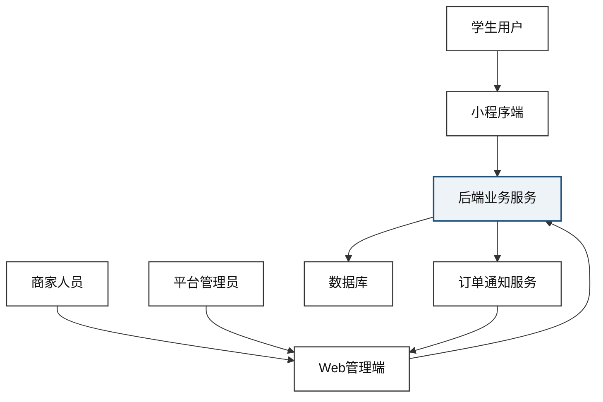

### `figure-4-1-architecture.mmd`

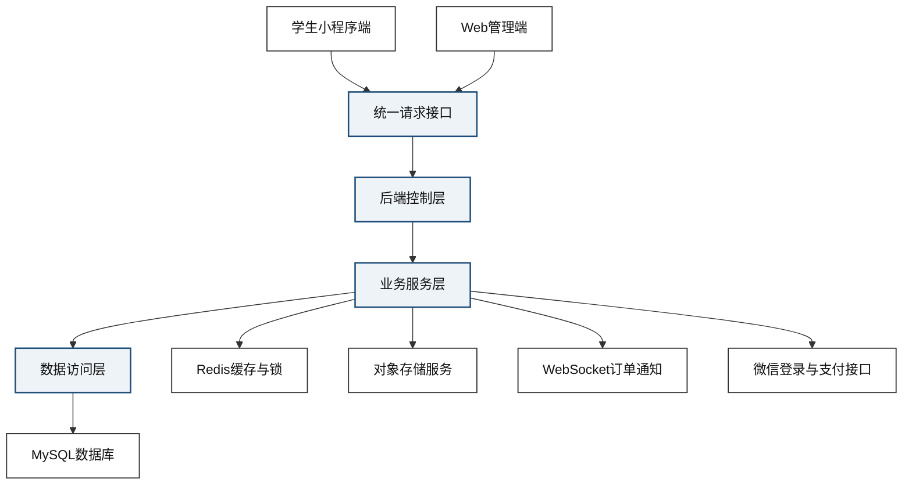

### `figure-4-2-modules.mmd`

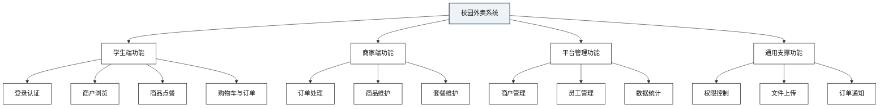

### `figure-5-1-er.mmd`

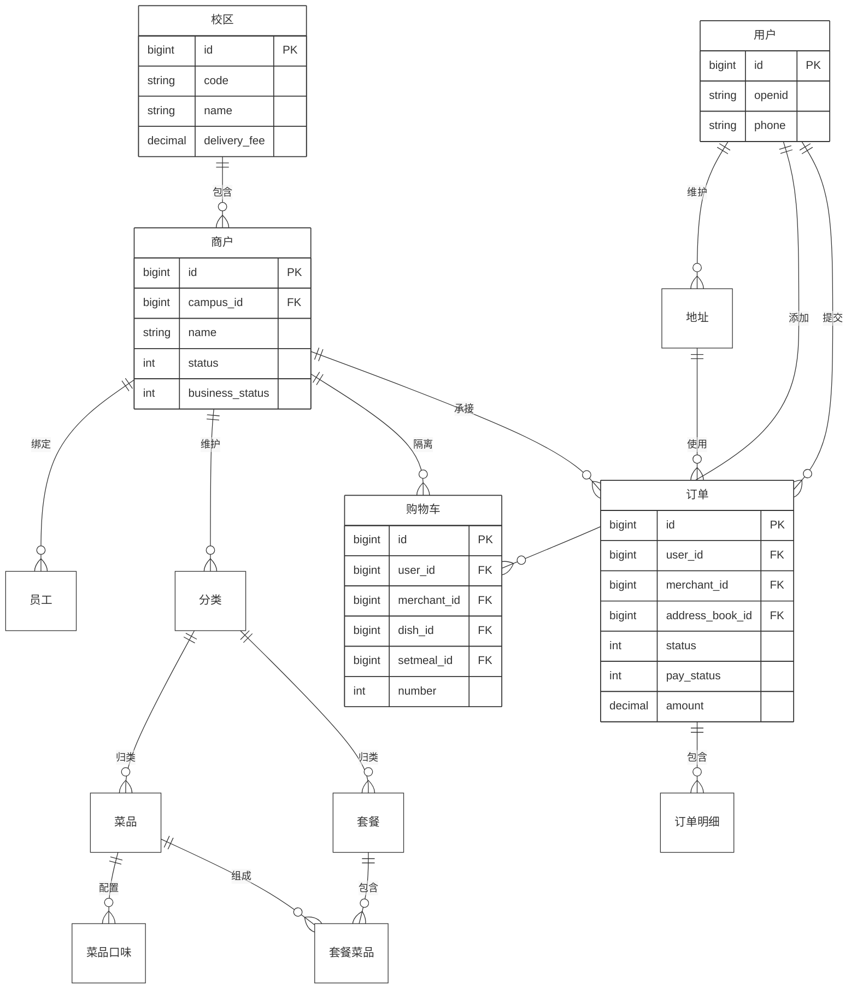

### `figure-5-2-order-state.mmd`

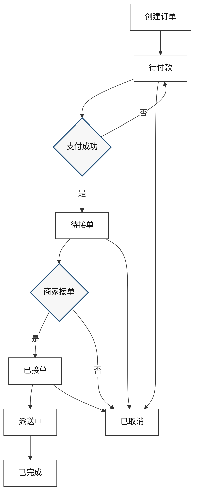

### `figure-6-1-login-flow.mmd`

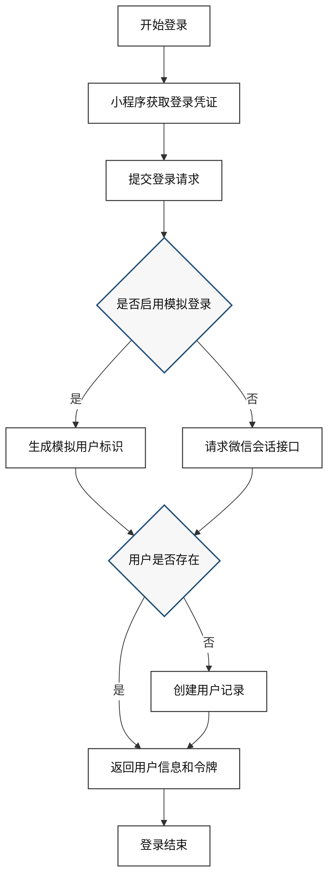

### `figure-6-2-merchant-browse-flow.mmd`

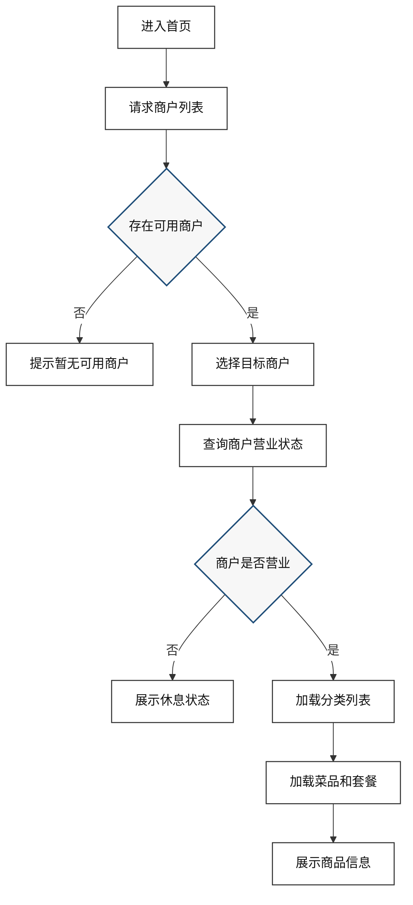

### `figure-6-3-cart-add-flow.mmd`

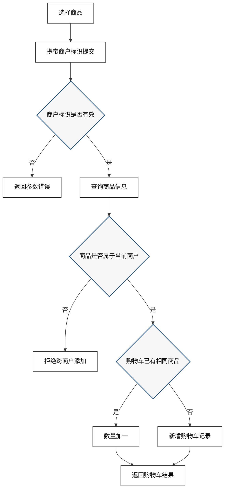

### `figure-6-4-order-submit-flow.mmd`

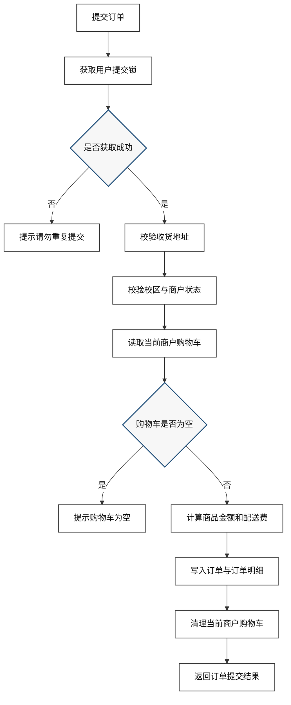

### `figure-6-5-payment-callback-flow.mmd`

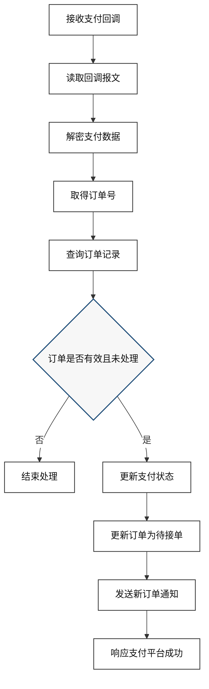

### `figure-6-6-merchant-order-flow.mmd`

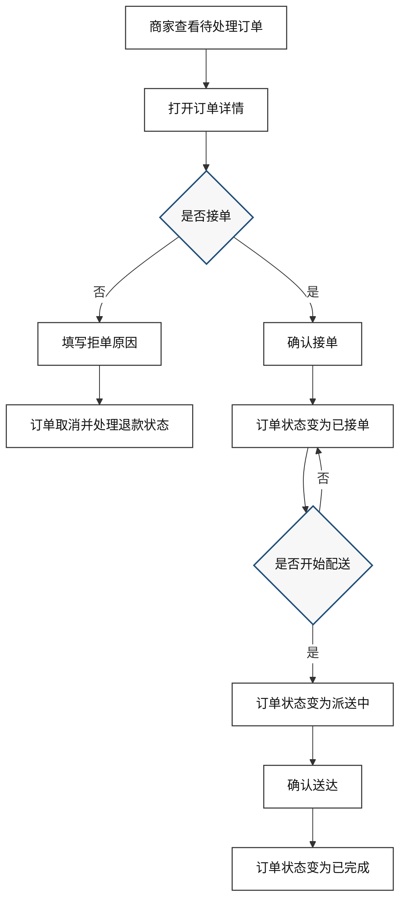

### `figure-6-7-reminder-flow.mmd`

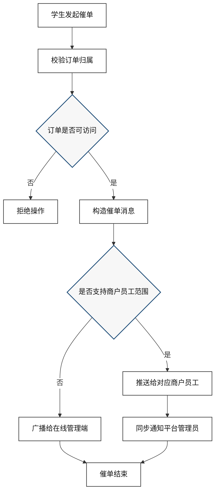
