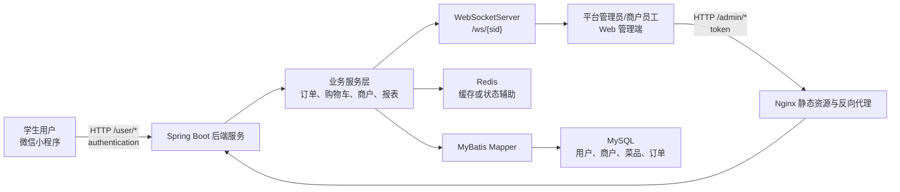
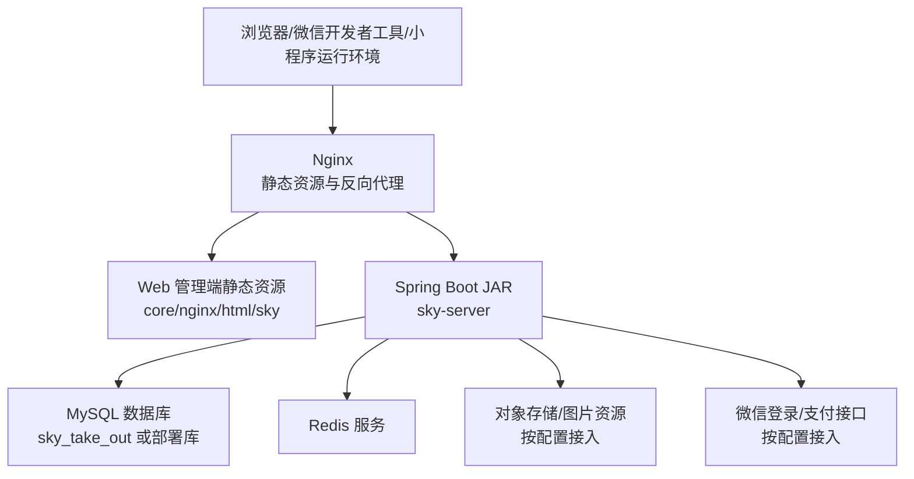
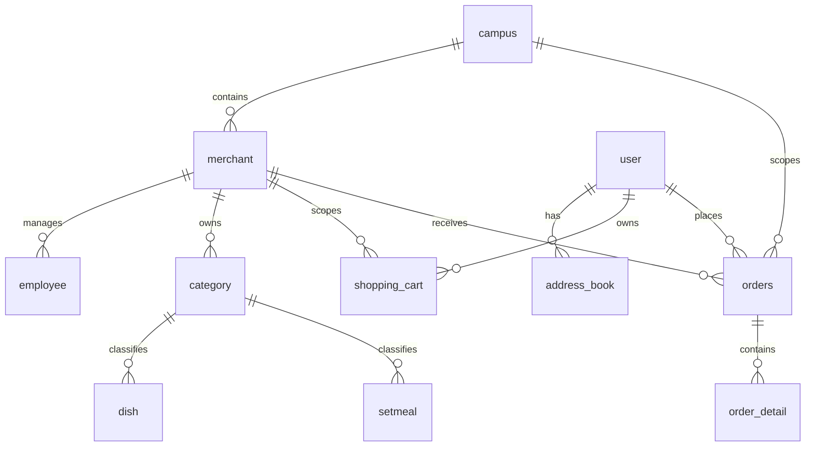

# 校园外卖点餐系统论文升级 staged content

## 0. 使用边界

本文件只作为 DOCX 升级前的内容 staging，不直接作为论文附录出现。正文写入时需要保留学校模板、标题层级、页眉页脚和字体规范。源码只作为事实核验依据，不在论文中描述本轮工作过程。

写作风格遵循 `C:\Users\g'y'c\Desktop\论文提示词.md`：

- 不使用第一人称。
- 不使用带“呢”的口语化提示句。
- 技术标识保持原样，如 Spring Boot、MyBatis、uni-app、JWT、Redis、WebSocket、merchant_id、/user/order/submit。
- 原文段落改写时尽量接近原文长度；新增表格、图题、测试说明可以适度增加。

## 1. 摘要替换文本

### 1.1 中文摘要建议稿

随着高校后勤服务数字化以及移动端应用场景的持续扩展，校园餐饮服务逐渐从窗口排队、电话订餐等线下方式，转向小程序点餐、商户在线管理以及订单状态实时跟踪。针对校园外卖点餐过程中存在的商户信息分散、菜品维护不及时、订单流转依赖人工沟通以及运营数据难以沉淀等问题，本课题围绕校园场景设计并实现了一套餐饮外卖点餐系统。系统选用 Spring Boot 构建后端服务，运用 MyBatis 进行数据访问，以 MySQL 存储用户、商户、菜品、购物车和订单等核心数据，并借助 Redis、JWT、WebSocket 等组件支撑状态辅助、身份认证以及订单提醒。小程序端基于 uni-app 开发，Web 管理端以 Nginx 静态资源形式提供商户和运营管理入口。

论文在需求建模基础上，对系统架构、数据库模型、关键业务流程、接口边界和质量验证进行了分析。系统以共享业务表中的 merchant_id、campus_id 以及 account_type 等字段表达商户作用域，并在登录认证、商户切换、购物车隔离、订单提交、订单通知和运营统计等流程中传递商户上下文。验证部分围绕登录认证、商品浏览、购物车隔离、订单生成、管理端处理、WebSocket 通知和统计报表等路径展开，重点检查功能闭环、权限边界和数据一致性。结果表明，系统能够覆盖校园外卖点餐的基本业务链路，并为多商户校园餐饮服务提供了可运行的工程基础。对于真实支付生产上线、大规模压力测试、长期稳定性和正式用户调研等缺乏充分证据的内容，论文只作为边界条件和后续改进方向进行说明。

关键词：校园外卖点餐系统；多商户管理；微信小程序；Spring Boot；订单管理

### 1.2 English abstract draft

With the continuous development of digital campus logistics services and mobile application scenarios, campus catering services are gradually shifting from offline modes such as window queuing and telephone ordering to mini-program ordering, online merchant management, and real-time order status tracking. To address problems such as scattered merchant information, delayed dish maintenance, manual communication in order processing, and insufficient accumulation of operational data, this project designs and implements a campus-oriented food delivery ordering system. The back-end service is built with Spring Boot and MyBatis, while MySQL stores core business data such as users, merchants, dishes, shopping carts, and orders. Redis, JWT, and WebSocket are used to support state assistance, identity authentication, and order notification. The mobile client is developed with uni-app, and the Web management terminal is provided as static resources deployed through Nginx.

Based on requirement modeling, the thesis analyzes system architecture, database design, key business processes, interface boundaries, and quality verification. The system expresses merchant scope through fields such as merchant_id, campus_id, and account_type in shared business tables, and transfers merchant context across login authentication, merchant switching, shopping cart isolation, order submission, order notification, and operational statistics. The verification work focuses on login authentication, dish browsing, shopping cart isolation, order generation, management-side processing, WebSocket notification, and report statistics, with particular attention to functional closure, permission boundaries, and data consistency. The results show that the system covers the basic business loop of campus food delivery ordering and provides an engineering foundation for multi-merchant campus catering services. Capabilities without sufficient evidence, such as production-level payment deployment, large-scale stress testing, long-term stability, and formal user research, are treated only as boundary conditions and future improvement directions.

Keywords: campus food delivery ordering system; multi-merchant management; WeChat mini program; Spring Boot; order management

## 2. 第二章补充内容

### 2.1 技术选型对比表

表 2.x 系统关键技术选型对比

| 技术点 | 选用方案 | 可替代方案 | 选用缘由 | 当前边界 |
|--------|----------|------------|----------|----------|
| 后端架构 | Spring Boot 分层单体 | Spring Cloud 微服务 | 校园商户规模可控，单体部署复杂度较低，控制器、服务层和 Mapper 层边界清晰 | 不具备独立服务拆分和服务治理能力 |
| 数据访问 | MyBatis | JPA、MyBatis-Plus | SQL 可控性较强，适宜订单、报表和多条件查询 | 需要持续检查 SQL 中的商户过滤条件 |
| 小程序端 | uni-app | 原生微信小程序 | 可复用 Vue 语法和 uni-app 页面组织方式，适宜移动端点餐场景 | 当前重点是微信小程序端，不展开多端适配验证 |
| 身份认证 | JWT | Session、OAuth2 | 适合前后端分离接口中的无状态身份传递 | 未包含刷新 token、黑名单和完整身份治理 |
| 实时通知 | WebSocket | SSE、轮询、消息队列 | 适合订单提醒和催单这类实时消息 | 未形成消息确认、离线补偿和失败重试机制 |
| 商户隔离 | 共享表 + merchant_id | 独立数据库、独立 schema、数据库 RLS | 实现成本较低，适合校园内有限商户数量 | 属于行级作用域控制，不是严格物理隔离 |

### 2.2 技术选型说明补充段

本系统在技术选型上更重视校园场景下的可落地性，而不是追求复杂架构的堆叠。Spring Boot 分层单体结构可以把控制器、业务服务、数据访问和配置管理组织在同一应用中，部署和调试成本相对较低。对于毕业设计阶段的校园外卖业务来说，商户数量、用户范围和业务规模通常处在可控范围内，因此没有必要一开始就引入完整的微服务拆分、服务注册、链路追踪和分布式事务治理。

MyBatis 的作用主要体现在 SQL 映射和动态查询方面。订单查询、报表统计以及商户过滤都需要根据时间、状态、账号类型和 merchant_id 等条件组合执行，采用 MyBatis 可以较直接地控制查询语句。与此同时，这种方式也要求系统持续检查 Mapper 层是否正确传递商户范围，避免因为漏加过滤条件而造成数据边界不清。

Redis、JWT 和 WebSocket 在系统中分别承担辅助状态、身份认证和订单提醒等职责。Redis 不应只作为技术名词出现，而应说明其用于缓存或状态辅助的定位；JWT 能够支撑用户端和管理端的无状态认证；WebSocket 可以把支付成功、催单等订单事件及时推送到商户端。需要说明的是，当前版本的 WebSocket 主要满足基础提醒需求，尚未形成完整的消息确认和离线补偿机制。

## 3. 第四章图表与正文素材

### 3.1 系统总体架构图

图题建议：图 4.x 系统总体架构图



配套正文：

系统总体架构由小程序端、Web 管理端、后端服务、数据库和消息通知组件共同组成。学生用户借助微信小程序访问 `/user` 前缀下的接口，管理端用户借助 Web 页面访问 `/admin` 前缀下的接口。Nginx 负责静态资源访问和必要的请求转发，Spring Boot 后端统一承接认证、权限、商户作用域、订单状态流转和统计逻辑。后端服务通过 MyBatis 访问 MySQL，借助 Redis 处理缓存或状态辅助，并通过 WebSocketServer 向商户员工和平台管理员发送订单事件。

### 3.2 部署结构图

图题建议：图 4.x 系统部署结构图



配套正文：

部署层面上，系统采用较直接的 Web 应用部署方式。Web 管理端资源以静态文件形式放置在 Nginx 目录中，后端以 Spring Boot 应用形式运行，并通过配置连接 MySQL、Redis、对象存储以及微信相关接口。该部署方式适合毕业设计阶段的演示和验证，也便于在校园级业务规模下控制运维复杂度。对于正式生产环境，还需要进一步补充 HTTPS、日志采集、备份恢复、支付证书管理和监控告警等能力。

### 3.3 核心 ER 关系内容

图题建议：图 4.x 核心实体关系图



配套正文：

核心数据模型以用户、商户、商品和订单为主线。campus 表表达校区服务范围，merchant 表表达校园内具体商户，employee 表通过 merchant_id 和 account_type 区分平台管理员、商户管理员以及商户员工。category、dish、setmeal 等商品相关表通过 merchant_id 表达商品所属商户。shopping_cart 通过 user_id 和 merchant_id 共同定位用户在当前商户下的临时购买数据。orders 通过 user_id、merchant_id、campus_id 和订单状态字段表达订单归属和流转阶段，order_detail 则保存订单中的具体商品明细。

### 3.4 角色权限矩阵

表题建议：表 4.x 角色权限矩阵

| 角色 | 主要入口 | 身份依据 | 主要权限 | 商户边界 |
|------|----------|----------|----------|----------|
| 学生用户 | 微信小程序 | user token 与 user_id | 浏览商户与菜品、维护购物车、提交订单、查看历史订单、催单 | 只能访问本人订单和购物车 |
| 商户员工 | Web 管理端 | token、account_type、merchant_id | 处理所属商户订单、查看所属商户业务数据 | 由 merchant_id 限定 |
| 商户管理员 | Web 管理端 | token、account_type、merchant_id | 管理所属商户商品、订单和基础运营信息 | 由 merchant_id 限定 |
| 平台管理员 | Web 管理端 | token、account_type | 管理商户、查看平台或指定商户数据 | 可按权限查看更大范围 |

配套正文：

角色权限设计的重点在于区分用户侧身份和管理侧身份。学生用户主要依靠 user_id 访问个人订单、地址和购物车；管理端账号则通过 account_type 区分平台管理员、商户管理员和商户员工。商户类账号需要绑定 merchant_id，并在查询、写入和统计过程中使用该字段限制业务范围。平台管理员虽然具备更大的管理范围，但也需要通过明确的查询条件和服务层校验避免口径混乱。

### 3.5 多商户隔离表述修正

建议替换或补充正文：

本系统的多商户能力不是物理意义上的独立数据库或独立 schema 隔离，而是在共享业务表中借助 merchant_id、campus_id 和 account_type 等字段进行行级作用域控制。迁移脚本为 employee、category、dish、setmeal、shopping_cart、orders 等表补充商户相关字段，并增加与商户、状态和时间相关的索引。运行时，MultiMerchantSchemaSupport 会检查多商户字段是否存在；服务层再借助 MerchantScopeUtils 解析当前账号能够访问的商户范围。这样处理能够在较低部署成本下支持校园内多商户管理，但也要求后续持续检查 Mapper 查询和统计 SQL 是否完整传递商户条件。

## 4. 第五章流程增强素材

### 4.1 登录认证流程

用户端和管理端采用不同的请求头传递身份凭据。用户端接口集中在 `/user` 前缀下，请求头使用 authentication；管理端接口集中在 `/admin` 前缀下，请求头使用 token。后端拦截器解析 JWT 后，将用户 id、员工 id、merchant_id 以及 account_type 等信息写入上下文。后续服务层可以依据上下文判断当前请求属于学生用户、商户账号还是平台账号，从而在订单、购物车和统计查询中执行不同的边界规则。

### 4.2 购物车隔离流程

购物车隔离是多商户点餐场景中的关键流程。用户在不同商户下加入商品时，系统需要同时记录 user_id 和 merchant_id。查询购物车时，后端根据请求中的 merchantId 或兼容字段 shopId 解析当前商户，并只返回该用户在当前商户下的购物车数据。提交订单后，系统也只清理当前商户范围内的购物车，避免用户在其他商户下尚未提交的商品被误删。

### 4.3 订单提交流程

订单提交过程将地址、购物车、商户、校区和订单明细连接在同一业务链路中。系统首先解析请求商户，检查用户地址是否存在，再判断商户和校区是否处于可下单状态。随后，系统读取当前用户在当前商户下的购物车，计算商品金额、配送费和商品数量，生成订单主表记录以及订单明细记录。该流程使用事务边界保证订单主表、明细表和购物车清理之间的一致性。若地址不存在、购物车为空或商户不可用，系统应返回业务异常而不是生成不完整订单。

### 4.4 订单通知流程

订单通知主要用于缩短用户下单后到商户响应之间的信息延迟。支付状态变更或用户催单时，后端会构造包含 type、event、orderId、merchantId 和 content 的消息，并通过 WebSocketServer 发送给相关商户员工；平台管理员也可以接收订单事件。若运行环境不具备完整员工商户字段，系统会采用广播方式作为兼容处理。该设计能够满足基础实时提醒，但还没有覆盖消息确认、失败重试和离线补偿，因此论文中应把这些内容列为后续改进方向。

### 4.5 运营统计流程

运营统计需要明确统计口径。营业额、订单数量和销量排行应围绕订单表、订单明细和商户范围进行聚合。商户账号查看统计时，应限制在所属 merchant_id 范围内；平台管理员可以按更大范围查看或筛选商户数据。用户数量统计与订单销售统计的业务口径不同，论文中需要说明它更偏向平台侧用户规模观察，不能简单等同于某一商户的销售能力。

## 5. 第六章测试与质量分析素材

### 5.1 详细测试用例表

表题建议：表 6.x 系统主要测试用例

| 编号 | 测试对象 | 前置条件 | 操作步骤 | 输入数据 | 预期结果 | 实际记录方式 | 结论 |
|------|----------|----------|----------|----------|----------|--------------|------|
| TC-01 | 登录认证 | 后端服务正常，存在用户或员工账号 | 登录后携带 token 访问受保护接口；再移除 token 访问同一接口 | authentication 或 token | 有效 token 可访问；无效或缺失 token 被拒绝 | 接口响应、后端日志 | 待执行记录 |
| TC-02 | 商户切换 | 至少存在两个启用商户 | 小程序端切换商户后刷新分类和菜品 | merchantId/shopId | 页面只展示当前商户商品 | 页面截图、接口返回 | 待执行记录 |
| TC-03 | 购物车隔离 | 同一用户可访问两个商户 | 分别向商户 A、商户 B 加入商品，再分别查询购物车 | user_id、merchant_id | 两个商户购物车互不影响 | 接口返回、数据库记录 | 待执行记录 |
| TC-04 | 订单提交 | 当前商户购物车存在商品，地址有效 | 提交订单并查看订单详情 | addressBookId、merchantId | 生成订单主表和明细，清理当前商户购物车 | 接口返回、数据库记录 | 待执行记录 |
| TC-05 | 空购物车下单 | 当前商户购物车为空 | 直接提交订单 | addressBookId、merchantId | 返回业务异常，不生成订单 | 接口返回、数据库记录 | 待执行记录 |
| TC-06 | 管理端订单处理 | 存在待确认订单 | 商户端执行确认、派送、完成操作 | orderId | 订单状态按流程变更 | 接口返回、订单状态 | 待执行记录 |
| TC-07 | 权限边界 | 存在商户账号和其他商户订单 | 商户账号查询非所属商户订单 | token、merchantId | 拒绝越权访问或返回空范围数据 | 接口响应、日志 | 待执行记录 |
| TC-08 | 订单通知 | WebSocket 连接建立 | 触发支付成功或催单流程 | orderNumber/orderId | 商户端收到 NEW_ORDER 或 ORDER_REMINDER 消息 | WebSocket 消息记录 | 待执行记录 |
| TC-09 | 统计报表 | 存在已完成订单数据 | 查询营业额、订单数量、销量排行 | begin、end、merchantId | 返回指定时间和商户范围内统计数据 | 接口返回 | 待执行记录 |
| TC-10 | 支付边界 | 系统处于模拟或测试支付配置 | 提交订单后执行支付接口 | orderNumber | 可验证订单状态流转，但不声明生产结算能力 | 接口返回、状态记录 | 待执行记录 |

### 5.2 质量分析补充段

从功能适合性看，系统覆盖了学生端点餐和管理端处理所需的主要业务节点，包括商户浏览、菜品展示、购物车维护、订单提交、订单处理、订单通知和经营统计。与普通商品展示系统相比，校园点餐系统更强调订单闭环和多商户边界，因此测试重点不只在页面是否能够打开，还要检查当前商户范围是否贯穿查询、写入和统计流程。

从可靠性看，订单提交、订单状态更新和购物车清理需要保持一致。系统在订单提交服务中把订单主表写入、订单明细写入和购物车清理放在同一业务流程里处理，这有助于减少部分写入成功、部分写入失败造成的数据不一致。WebSocket 通知能够提供实时提醒，但长连接状态本身受网络和客户端运行环境影响，后续若要进一步提高可靠性，可以引入消息确认、重试机制或消息队列。

从安全性看，JWT、account_type、merchant_id 和服务层校验共同构成基础访问控制。学生用户只能访问本人订单和购物车，商户账号需要限制在所属商户范围内，平台管理员则需要明确查询口径。由于用户地址、手机号和订单明细属于敏感业务数据，系统后续仍需要继续补充密码存储、敏感信息保护、日志审计以及接口防重放等安全设计。

从可维护性看，系统按控制器、服务层、Mapper 和实体对象组织代码，职责边界相对清楚。多商户能力通过迁移脚本、schema 检测和商户作用域工具类逐步接入，可以降低单店系统向多商户系统迁移时的风险。但兼容逻辑也会带来额外复杂度，后续应在数据库迁移稳定后减少不必要的双模式分支。

## 6. 附录接口示例素材

### 6.1 用户端订单提交接口

接口：`POST /user/order/submit`

请求示例：

```json
{
  "addressBookId": 1,
  "merchantId": 1,
  "shopId": 1,
  "remark": "少辣",
  "tablewareNumber": 1,
  "tablewareStatus": 1
}
```

响应示例：

```json
{
  "code": 1,
  "msg": null,
  "data": {
    "id": 1001,
    "orderNumber": "1710000000000",
    "orderAmount": 28.00,
    "orderTime": "2026-05-04T12:00:00"
  }
}
```

说明：该接口需要用户端携带 authentication，请求中的 merchantId 或 shopId 用于确定当前商户上下文。

### 6.2 用户端购物车查询接口

接口：`GET /user/shoppingCart/list?merchantId=1`

说明：该接口返回当前用户在指定商户下的购物车数据。若系统处于多商户 schema 可用状态，查询需要同时依据 user_id 和 merchant_id 过滤。

### 6.3 管理端订单查询接口

接口：`GET /admin/order/conditionSearch`

参数示例：`page=1&pageSize=10&status=2&merchantId=1`

说明：管理端订单查询需要携带 token。商户账号查询时，服务层应将查询范围限制在当前账号绑定的 merchant_id；平台管理员可以按权限查看更大范围或指定商户范围。

### 6.4 管理端统计接口

接口示例：

- `GET /admin/report/turnoverStatistics`
- `GET /admin/report/ordersStatistics`
- `GET /admin/report/top10`

说明：统计接口应明确 begin、end 和商户范围。论文中需要区分平台统计口径和商户统计口径，避免把用户数量统计直接写成单个商户的经营效果。

## 7. DOCX 插入策略

| 内容 | 插入位置 | 处理方式 |
|------|----------|----------|
| 中文摘要和英文摘要 | 原摘要位置 | 替换原摘要正文，保留标题样式 |
| 技术选型对比表 | 2.4 技术选型与适配性分析 | 新增表格 |
| 系统总体架构图 | 4.1 总体架构设计 | 插入图和图题 |
| 部署结构图 | 4.1 或 4.2 后 | 插入图和图题 |
| ER 图 | 4.4 数据库实体与多商户隔离 | 插入图和图题 |
| 角色权限矩阵 | 4.5 接口边界与安全设计 | 新增表格 |
| 关键流程增强段 | 第五章对应小节 | 局部替换或追加短段 |
| 测试用例表 | 6.2 功能测试 | 新增表格，必要时拆分 |
| 质量分析段 | 6.4 质量分析 | 替换重复段落并补充维度 |
| 接口示例 | 附录 B | 追加典型接口示例 |

## 8. staged content 自检

- 没有使用第一人称。
- 没有把 row-level merchant scope 写成 strict schema isolation。
- 没有声明生产级真实支付、大规模压测、长期稳定性或正式用户调研已经得到验证。
- 没有把源码修复过程写入论文内容。
